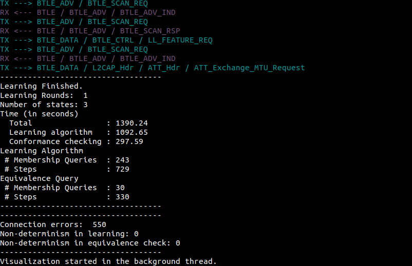

# Fingerprinting Bluetooth Low Energy via Active Automata Learning


This repository contains the supplemental material to the paper 'Fingerprinting Bluetooth Low Energy via Active Automata Learning' of Andrea Pferscher and Bernhard K. Aichernig (Institute of Software Technology, Graz University of Technology).

##  Content
 - Learned models ([learned-automata/](https://github.com/apferscher/ble-learning/tree/main/learned-automata)):
    - [CYBLE-416045-02](https://github.com/apferscher/ble-learning/blob/main/learned-automata/CYBLE-416045-02.dot)
    - [nRF52832](https://github.com/apferscher/ble-learning/blob/main/learned-automata/nRF52832.dot) 
    - [CC2650](https://github.com/apferscher/ble-learning/blob/main/learned-automata/CC2650.dot)
    - [CYW43455](https://github.com/apferscher/ble-learning/blob/main/learned-automata/CYW43455.dot)
    - [CC2640R2 (no pairing request)](https://github.com/apferscher/ble-learning/blob/main/learned-automata/CC2640R2-no-pairing-req.dot)
    - [CC2640R2 (no length request)](https://github.com/apferscher/ble-learning/blob/main/learned-automata/CC2640R2-no-length-req.dot)
    - [CC2640R2 (no feature request)](https://github.com/apferscher/ble-learning/blob/main/learned-automata/CC2640R2-no-feature-req.dot)
- Learning results ([learning-results/](https://github.com/apferscher/ble-learning/tree/main/learning-results)):
    - [CYBLE-416045-02](https://github.com/apferscher/ble-learning/blob/main/learning-results/CYBLE-416045-02.txt)
    - [nRF52832](https://github.com/apferscher/ble-learning/blob/main/learning-results/nRF52832.txt)
    - [CC2650](https://github.com/apferscher/ble-learning/blob/main/learning-results/CC2650.txt)
    - [CYW43455](https://github.com/apferscher/ble-learning/blob/main/learning-results/CYW43455.txt)
    - [CC2640R2 (no pairing request)](https://github.com/apferscher/ble-learning/blob/main/learning-results/CC2640R2-no-pairing-req.txt)
    - [CC2640R2 (no length request)](https://github.com/apferscher/ble-learning/blob/main/learning-results/CC2640R2-no-length-req.txt)
    - [CC2640R2 (no feature request)](https://github.com/apferscher/ble-learning/blob/main/learning-results/CC2640R2-no-feature-req.txt)
- Firmware ([firmware/](https://github.com/apferscher/ble-learning/tree/main/firmware))
    - [Nordic nRF52840 Dongle](https://github.com/apferscher/ble-learning/blob/main/firmware/nRF52840_dongle_firmware.hex)
    - Nordic nRF52840 Development Kit: [s140_nrf52_6.1.1_softdevice](https://github.com/apferscher/ble-learning/blob/main/firmware/s140_nrf52_6.1.1_softdevice.hex.hex) + [nrf52840_dk_firmware](https://github.com/apferscher/ble-learning/blob/main/firmware/nrf52840_dk_firmware.hex)
- Framework
    - experiment execution ([ble_learning.py](https://github.com/apferscher/ble-learning/blob/main/ble_learning.py))

## Installation

### Prerequisites

1. Nordic nRF52840 Dongle or Development Kit flashed with corresponding firmware

    **Flashing:** You can use the programmer tool of the [nRF Connect for Desktop](https://www.nordicsemi.com/Software-and-tools/Development-Tools/nRF-Connect-for-desktop) application to flash the provided firmware on the [Nordic nRF52840 Dongle](https://github.com/apferscher/ble-learning/blob/main/firmware/nRF52840_dongle_firmware.hex) or [Nordic nRF52840 Development Kit](https://github.com/apferscher/ble-learning/blob/main/firmware/nrf52840_dk_firmware.hex).

    For the development kit you first have to write the [s140_nrf52_6.1.1_softdevice](https://github.com/apferscher/ble-learning/blob/main/firmware/s140_nrf52_6.1.1_softdevice.hex.hex) file and then the [nrf52840_dk_firmware](https://github.com/apferscher/ble-learning/blob/main/firmware/nrf52840_dk_firmware.hex).

    The firmware is taken from the [SweynTooth project](https://github.com/Matheus-Garbelini/sweyntooth_bluetooth_low_energy_attacks).

2. Python 3

3. Python libraries [Scapy >=v2.4.5](https://github.com/secdev/scapy), [Aalpy >=1.0.1](https://github.com/DES-Lab/AALpy) and [Colorama](https://pypi.org/project/colorama/)

    **Requirements installation:** 

    ```bash
    sudo pip3 install -r requirements.txt
    ```

### Experiment Execution

The learning procedure of a Bluetooth Low Energy (BLE) device can be executed via ([ble_learning.py](https://github.com/apferscher/ble-learning/blob/main/ble_learning.py)). The program requires the serial port name of the nRF52 device and the BLE address of the peripheral device (advertiser) that should be learned.

    python3 ble_learning.py <serial_port> <advertiser_address>

Example:

    python3 ble_learning.py /dev/ttyACM0 00:A0:50:00:00:03

The program outputs the learning results after a successful learning procedure and saves the learned model in the file ` LearnedModel.dot`. 




## Acknowledgement
- [SweynTooth](https://github.com/Matheus-Garbelini/sweyntooth_bluetooth_low_energy_attacks): nRF52 driver, firmware and code snippets for BLE package construction
- [AALpy](https://github.com/DES-Lab/AALpy): active automata learning library
- [Scapy](https://github.com/secdev/scapy): BLE package parsing and composition
- [Colorama](https://github.com/secdev/scapy): colored terminal text


