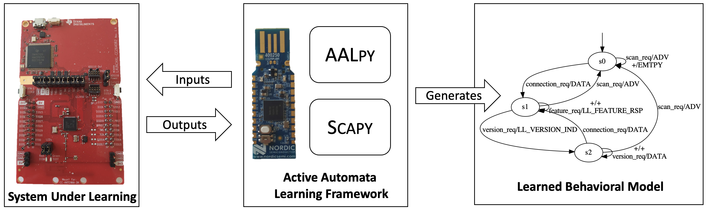

# Fingerprinting Bluetooth Low Energy via Active Automata Learning


This repository contains the supplemental material to the article 'Identification and Analysis of Bluetooth Devices via Automata Learning' and to the paper 'Fingerprinting Bluetooth Low Energy via Active Automata Learning' of Andrea Pferscher and Bernhard K. Aichernig (Institute of Software Technology, Graz University of Technology).



This repository provides a framework that learns the behavioral model of a black-box Bluetooth Low Energy (BLE) device by active automata learning. The framework can learn the model of the connection procedure and the legacy pairing procedure. This repository also contains the learned models and learning results of the performed case study.

##  Content
 - Learned models ([learned-automata/](learned-automata/)):
    - Pairing procedure models ([pairing-procedure/](learned-automata/pairing-procedure/)):
        - [CC2640R2](learned-automata/pairing-procedure/cc2640r2.dot) \[[PDF](learned-automata/pairing-procedure/pdfs/cc2640r2.pdf)\]
        - [CC2650](learned-automata/pairing-procedure/cc2650.dot) \[[PDF](learned-automata/pairing-procedure/pdfs/cc2650.pdf)\]
        - [CYW43455](learned-automata/pairing-procedure/cyw43455.dot) \[[PDF](learned-automata/pairing-procedure/pdfs/cyw43455.pdf)\]
    - [CYBLE-416045-02](learned-automata/CYBLE-416045-02.dot) \[[PDF](learned-automata/pdfs/cyble-416045-02.pdf)\]
    - [nRF52832](learned-automata/nRF52832.dot) \[[PDF](learned-automata/pdfs/nRF52832.pdf)\]
    - [CC2650](learned-automata/CC2650.dot) \[[PDF](learned-automata/pdfs/cc2650.pdf)\]
    - [CYW43455](learned-automata/CYW43455.dot) \[[PDF](learned-automata/pdfs/cyw43455.pdf)\]
    - [CC2640R2 (no pairing request)](learned-automata/CC2640R2-no-pairing-req.dot) \[[PDF](learned-automata/pdfs/CC2640R2-no-pairing-req.pdf)\]
    - [CC2640R2 (no length request)](learned-automata/CC2640R2-no-length-req.dot) \[[PDF](learned-automata/pdfs/CC2640R2-no-length-req.pdf)\]
    - [CC2640R2 (no feature request)](learned-automata/CC2640R2-no-feature-req.dot) \[[PDF](learned-automata/pdfs/CC2640R2-no-feature-req.pdf)\]
    - [CC2652R1](learned-automata/cc2652r1.dot) \[[PDF](learned-automata/pdfs/cc2652r1.pdf)\]
- Learning results ([learning-results/](learning-results/)):
    - Pairing procedure ([pairing-procedure/](learning-results/pairing-procedure/))
        - [CC2640R2](learning-results/pairing-procedure/cc2640r2.txt)
        - [CC2650](learning-results/pairing-procedure/cc2650.txt)
        - [CYW43455](learning-results/pairing-procedure/CYW43455.txt)
    - [CYBLE-416045-02](learning-results/CYBLE-416045-02.txt)
    - [nRF52832](learning-results/nRF52832.txt)
    - [CC2650](learning-results/CC2650.txt)
    - [CYW43455](learning-results/CYW43455.txt)
    - [CC2640R2 (no pairing request)](learning-results/CC2640R2-no-pairing-req.txt)
    - [CC2640R2 (no length request)](learning-results/CC2640R2-no-length-req.txt)
    - [CC2640R2 (no feature request)](learning-results/CC2640R2-no-feature-req.txt)
    - [CC2652R1](learning-results/cc2652r1.txt)
- Firmware ([firmware/](firmware/))
    - [Nordic nRF52840 Dongle](firmware/nRF52840_dongle_firmware.hex)
    - Nordic nRF52840 Development Kit: [s140_nrf52_6.1.1_softdevice](firmware/s140_nrf52_6.1.1_softdevice.hex.hex) + [nrf52840_dk_firmware](firmware/nrf52840_dk_firmware.hex)
- Framework
    - connection procedure experiment ([ble_learning.py](ble_learning.py))
    - connection procedure experiment (after connection) ([ble_learning_connecting_start.py](ble_learning_connecting_start.py))
    - pairing procedure experiment ([ble_learning_pairing.py](ble_learning_pairing.py))

## Installation

### Prerequisites

1. Nordic nRF52840 Dongle or Development Kit flashed with corresponding firmware

    **Flashing:** You can use the programmer tool of the [nRF Connect for Desktop](https://www.nordicsemi.com/Software-and-tools/Development-Tools/nRF-Connect-for-desktop) application to flash the provided firmware on the [Nordic nRF52840 Dongle](https://github.com/apferscher/ble-learning/blob/main/firmware/nRF52840_dongle_firmware.hex) or [Nordic nRF52840 Development Kit](https://github.com/apferscher/ble-learning/blob/main/firmware/nrf52840_dk_firmware.hex).

    For the development kit (possibly also for the dongle) you first have to write the [s140_nrf52_6.1.1_softdevice](https://github.com/apferscher/ble-learning/blob/main/firmware/s140_nrf52_6.1.1_softdevice.hex) file and then the [nrf52840_dk_firmware](https://github.com/apferscher/ble-learning/blob/main/firmware/nrf52840_dk_firmware.hex). 

    The firmware is taken from the [SweynTooth project](https://github.com/Matheus-Garbelini/sweyntooth_bluetooth_low_energy_attacks).

2. Python 3.9

3. Python libraries [pySerial](https://github.com/pyserial/pyserial), [Scapy >=v2.4.5](https://github.com/secdev/scapy), [Aalpy >=1.1.7](https://github.com/DES-Lab/AALpy) and [Colorama](https://pypi.org/project/colorama/), [pycryptodome](https://pypi.org/project/pycryptodome/)

    **Requirements installation:** 

    ```bash
    sudo pip3 install -r requirements.txt
    ```

Only learning the pairing procedure the following the pairing procedure:

4.  Installation of python3.9-dev:
    ```bash
    sudo apt-get install python3.9-dev
    ```

5. Installation of Security Manager interface:
    ```bash
    cd libs/smp_server/;sudo python3.9 setup.py install
    ```


### Experiment Execution

The learning procedure of a Bluetooth Low Energy (BLE) device can be executed via ([ble_learning.py](https://github.com/apferscher/ble-learning/blob/main/ble_learning.py)). The program requires the serial port name of the nRF52 device and the BLE address of the peripheral device (advertiser) that should be learned.

    python3 ble_learning.py <serial_port> <advertiser_address> [<pcap|dot filename>]

Example:

    python3 ble_learning.py /dev/ttyACM0 00:A0:50:00:00:03 

The program outputs the learning results after a successful learning procedure and saves the learned model in the file ` LearnedModel.dot`. 


## Acknowledgement
- [SweynTooth](https://github.com/Matheus-Garbelini/sweyntooth_bluetooth_low_energy_attacks): nRF52 driver, firmware and code snippets for BLE package construction
- [AALpy](https://github.com/DES-Lab/AALpy): active automata learning library
- [Scapy](https://github.com/secdev/scapy): BLE package parsing and composition
- [Colorama](https://github.com/tartley/colorama): colored terminal text


